# 금연 성공률 예측 및 금연 클리닉 대시보드

<div align="center">

**당신의 폐가 미소 짓는 날, 그 여정을 함께합니다.**

지역사회건강조사 데이터 기반 AI 금연 성공 예측 시스템


</div>

---

## 목차
- [팀 소개](#팀-소개)
- [프로젝트 개요](#프로젝트-개요)
- [데이터 분석](#데이터-분석)
- [모델링 및 결과](#모델링-및-결과)
- [산출물](#산출물)
- [프로젝트 구조](#프로젝트-구조)
- [실행 방법](#실행-방법)
- [팀 회고](#팀-회고)

---

## 팀 소개

<div align="center">

### **상민 크로스 해적단**
 
| 김소희 | 마한성 | 박도연 | 오흥재 | 임상민 |
| :---: | :---: | :---: | :---: | :---: |
|  |  |  |  |  |
| [](https://github.com/sosodoit) | [](https://github.com/gitsgetit) | [](https://github.com/doyeon) | [](https://github.com/vfxpedia) | [](https://github.com/sangmin) |
| **가구/소득 분석** | **정신건강 분석** | **음주/신체활동 분석** | **교육/경제활동 분석** | **식생활/비만 분석** |

**프로젝트 기간**: 2025.10.14 ~ 2024.10.15 (2일)

</div>

---

## 프로젝트 개요

### 프로젝트 목표
내원한 개인의 현재 특성으로 **"금연 성공 확률"을 예측**하고, 상담자가 바로 활용할 수 있도록 **세분화·우선순위·맞춤 개입 제안**을 제공하는 대시보드를 운영합니다.

**예측의 활용 목적:**
1. **상담 강도/전략 결정**: 금연 성공 가능성에 따른 맞춤형 상담 강도 설정
2. **고위험군 조기 식별**: 금연 실패 가능성이 높은 대상자 사전 파악
3. **경과 모니터링**: 개입 효과 점검 및 지속적 관리

### 프로젝트 필요성
- **공공보건정책**: 금연 성공 가능성이 낮은 집단을 사전에 파악 가능
- **맞춤형 지원**: 개인별 특성에 맞는 구체적인 행동 개선 방향 제시
- **자원 효율화**: 지역별·계층별 금연지원 프로그램 설계의 근거 데이터 제공

### 기대 효과
- 데이터 기반 정책/캠페인 설계
- 금연 성공률 향상 및 의료비 절감
- 향후 "맞춤형 금연 지원 서비스" 개발로 확장 가능

### 기술 스택
<div align="center">


</div>

---

## 데이터 분석

### 1. 데이터 출처 및 규모

**데이터 출처**: 2024년 지역사회건강조사 (Community Health Survey, CHS)
- **조사 기관**: 질병관리청 및 지역 보건소
- **조사 대상**: 만 19세 이상 성인
- **조사 기간**: 2024년 5월 16일 ~ 7월 31일
- **조사 형태**: 단면조사 (Cross-sectional)
- **원본 데이터**: 231,728명 × 209개 변수

**분석 데이터**:
- **필터링 기준**: 과거 또는 현재 흡연 경험이 있는 응답자
- **최종 분석 대상**: 89,822명 (전체의 약 38.8%)
- **전처리 후**: 89,822명 × 83개 변수

<div align="center">

</div>

### 2. 타겟 변수 정의

**목표 변수**: `churn` (금연 성공 여부)
- **churn = 1** (금연 성공): 49,251명 (54.8%)
- **churn = 0** (금연 실패): 40,571명 (45.2%)

<details>
<summary><b>타겟 변수 생성 코드 보기</b></summary>

```python
def make_target(data):
    # 과거 또는 현재 흡연자만 도출
    anal_data = data[~((data['sma_03z2'] > 3.0) & 
                       (data['sma_12z2'] > 2.0) & 
                       (data['sma_37z1'] > 3.0))].reset_index(drop=True)
    
    # 현재 흡연 여부 (하나라도 현재 피우고 있으면 흡연 중)
    currently_smoking = (
        anal_data['sma_03z2'].isin([1, 2]) |      # 일반담배 현재 흡연
        (anal_data['sma_12z2'] == 1) |             # 액상형 전자담배 현재 사용
        anal_data['sma_37z1'].isin([1, 2])        # 궐련형 전자담배 현재 사용
    )

    # 과거에 피웠으나 현재 피우지 않음
    stop_smoked = (
        (anal_data['sma_03z2'] == 3) |             # 과거 흡연
        (anal_data['sma_12z2'] == 2) |             # 액상형 과거 사용
        (anal_data['sma_37z1'] == 3)              # 궐련형 과거 사용
    )

    # 금연 성공자: 현재는 흡연 안 하고, 과거엔 피운 적 있음
    anal_data['churn'] = np.where(
        (~currently_smoking) & stop_smoked,
        1,  # 금연 성공
        0   # 금연 실패
    )
    
    # 액상형 특이 케이스 보정
    anal_data = Liquid_method2(anal_data)

    return anal_data
```

</details>

<div align="center">

</div>

### 3. 데이터 정제 프로세스

```
 1. raw_data.csv (231,728 rows × 209 columns)
   ↓ 타겟 변수 생성 (churn)
 
 2. analy_data_v2.csv (89,822 rows × 210 columns)
   ↓ 공통 전처리 ('b'문자 삭제, NaN 변환)
 
 3. 전처리 완료 (89,822 rows × 75 columns)
   ↓ 파생변수 생성 (30개 추가)
 
 4. 파생변수 생성 완료 (89,822 rows × 105 columns)
   ↓ 원본 변수 제거 (22개)
 
 5. prep_data_v2.csv (89,822 rows × 83 columns)
   → 모델 학습 준비 완료
```

<div align="center">

</div>

### 4. 주요 전처리 작업

**1) 'b' 문자 전처리**
- 식별자 코드에 포함된 `b'0001'` 형태를 분리하여 실제 값만 사용

**2) 설문 특수코드 처리**

<details>
<summary><b>설문조사 Skip Logic 분석 (논리적 결측값 이해)</b></summary>

### 핵심 이슈: "논리적 결측값"

설문조사는 응답에 따라 특정 질문을 건너뛰는 Skip Logic을 사용합니다. 이로 인해 발생하는 결측값은 "모름/무응답"이 아닌 **"해당 없음"**을 의미하므로, 단순 대치가 아닌 **NaN 유지**가 적절합니다.

```
[Q1: smf_01z1] 담배 경험?
├─ YES (89,950명) → Q2로
└─ NO (141,774명) → Q8로 (건너뛰기)
    ↓ Q2~7 모두 skip
    ↓ 결측값의 의미: "비흡연자"

[Q2-1: sma_03z2] 현재 흡연?
├─ ① 매일 피운다 (33,801명)
│   ↓ smb_01z1 (하루 흡연량)
│   ↓ Q6-7 (금연시도/계획) 답변 가능
│
├─ ② 가끔 피운다 (3,597명)  
│   ↓ smb_02z1, smb_03z1
│   ↓ Q6-7 답변 가능
│
└─ ③ 과거 흡연, 현재 안 피움 (52,059명) ⭐
    ↓ smb_09z1 (금연기간) ← 이게 churn=1의 핵심!
    ↓ smd_01z3 (금연계획) = 비해당(결측)
```

**특수 코드 처리 방침:**
- `7` = 응답거부
- `8` = 비해당 (Skip Logic)
- `9` = 모름
- 위 코드는 모두 **NaN**으로 변환

**처리 이유:**
- 범주형 변수 (예: 교육수준 1=무학, 2=서당, ..., 10=대학원)에서 7/8/9는 유효한 범주가 아님
- 평균/최빈값 대치 시 응답 의미 왜곡 발생
- NaN 유지 후 모델 단계에서 적절한 인코딩/결측 처리 수행

</details>

**3) 파생변수 생성 (총 14개)**
- **교육/경제활동** (5개): 교육수준 그룹, 경제활동 여부, 직업 유형, 임금근로자 여부, 혼인 안정성
- **가구/소득** (6개): 연령대 그룹, 1인 가구 여부, 월간 가구소득, 가구소득 로그변환, 치매 가족 동거 여부
- **체중/신체활동** (2개): 체중조절 방법, 신체활동 점수
- **시간변환** (1개): 시간-분 통합

### 5. 주요 EDA 발견 사항

#### 가구 환경 분석

<div align="center">

| 성별·연령대별 흡연이탈률 | 1인 가구 흡연이탈률 |
|:---:|:---:|
| 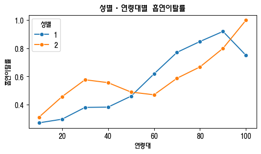 | 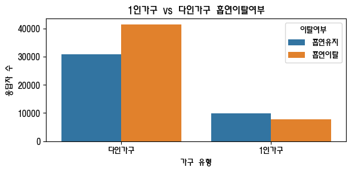 |
| **고연령층일수록 금연 성공률 높음**<br>여성은 남성보다 이른 시기 금연 | **1인 가구의 이탈률이 낮음**<br>(사회적 지지 부족 가능성) |

</div>

<div align="center">
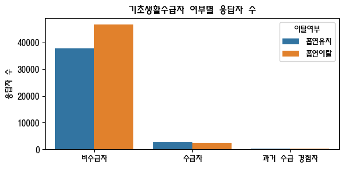

**경제적 여유**: 비수급자의 이탈률이 높음
</div>

#### 음주 행태 분석

<div align="center">

| 폭음과 금연 성공률 | 절주 계획과 금연 성공률 |
|:---:|:---:|
| 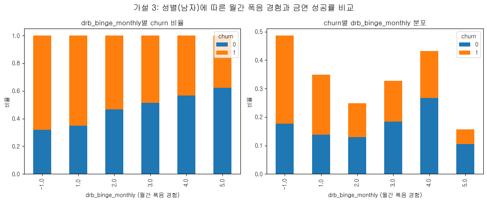 | 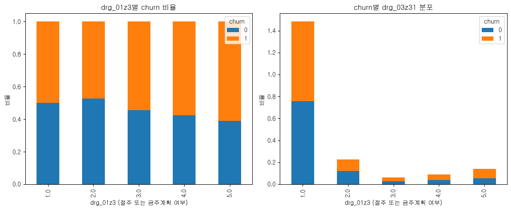 |
| 폭음 빈도 증가 → **금연 실패율 증가**<br>(자기조절 능력과 연관) | 금주 계획 有 → **금연 성공률 증가**<br>(건강 의지 반영) |

</div>

#### Feature Engineering 효과

<div align="center">
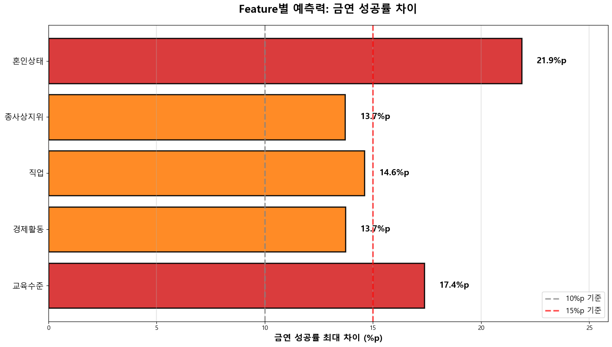

**예측력 향상 (금연 성공률 최대 차이)**
1. 혼인상태: **21.9%p** 차이
2. 교육수준: **17.4%p** 차이
3. 직업: **14.6%p** 차이
4. 경제활동: **13.7%p** 차이
</div>

<div align="center">
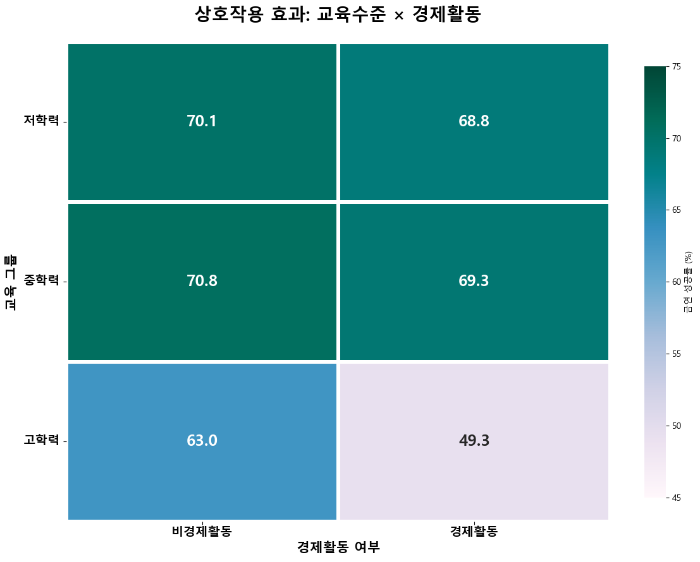

**상호작용 효과**: 고학력 + 경제활동 → 금연 성공률 최고 (약 75%)
</div>

---

## 모델링 및 결과

### 1. 문제 정의

| 구분 | 내용 |
|---|---|
| **입력(Feature)** | 개인 및 가구 단위의 사회경제·건강 정보 (83개 변수) |
| **출력(Target)** | churn = 금연 성공 여부 (1: 성공, 0: 실패) |
| **문제 유형** | 이진 분류 (Binary Classification) |
| **평가 지표** | ROC-AUC (주지표), Accuracy, PR-AUC |
| **검증 방법** | Stratified K-Fold (K=5) 교차검증 |

### 2. 모델 학습 전략

**데이터 분할**: Stratified 기반 학습/테스트 분리 (8:2)
```python
X_train, X_test, y_train, y_test = train_test_split(
    X, y, test_size=0.2, stratify=y, random_state=2
)
# 결과: 학습 71,857명 | 테스트 17,965명
```

**모델 후보**: CatBoost, XGBoost, LightGBM, HistGradientBoosting

**AUC를 주평가지표로 선택한 이유**:
- 분류 임계값에 덜 민감하여 전체 구간 성능을 평가
- 클래스 불균형 상황에서도 강건
- 운영 단계에서 임계값 조정 시에도 모델 간 우열 비교 가능

### 3. 모델 성능 비교

| 모델 | Accuracy | ROC-AUC | PR-AUC | 학습시간(초) |
|:---|---:|---:|---:|---:|
| **CatBoost** | **0.7070** | **0.7784** | **0.7923** | 100.078 |
| LightGBM | 0.7062 | 0.7767 | 0.7912 | 0.531 |
| HistGradientBoosting | 0.6974 | 0.7691 | 0.7826 | 3.458 |
| XGBoost | 0.6921 | 0.7614 | 0.7788 | 2.301 |

> **CatBoost가 ROC-AUC, PR-AUC 모두 최고 성능으로 최종 선정**

### 4. 최종 모델 성능 (CatBoost)

<div align="center">

**테스트 세트 성능 지표**

| Accuracy | ROC-AUC | PR-AUC |
|:---:|:---:|:---:|
| 0.7067 | 0.7784 | 0.7923 |

</div>

#### 혼동 행렬 (Confusion Matrix)

<div align="center">
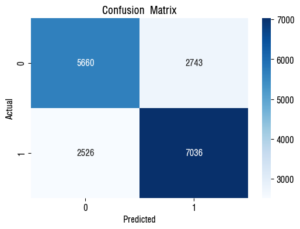
</div>

#### ROC Curve & Precision-Recall Curve

<div align="center">
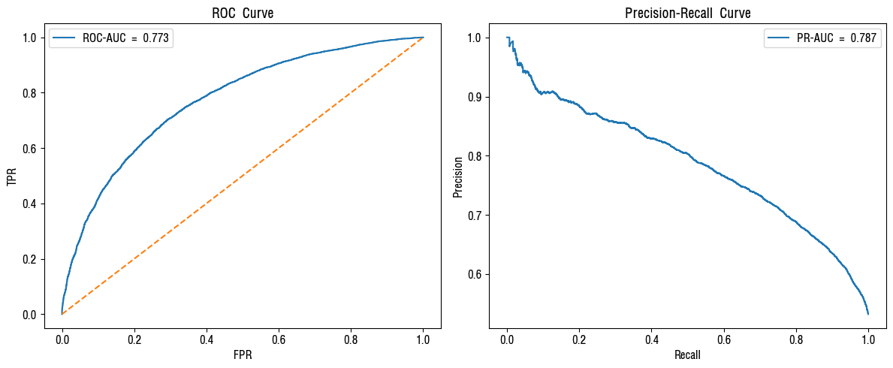
</div>

#### 특성 중요도 (Feature Importance)

<div align="center">

| CatBoost 내장 중요도 | Permutation 기반 중요도 |
|:---:|:---:|
| 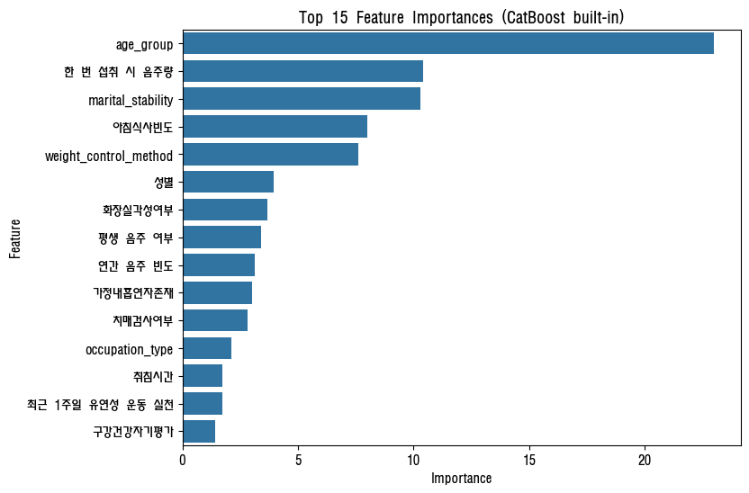 | 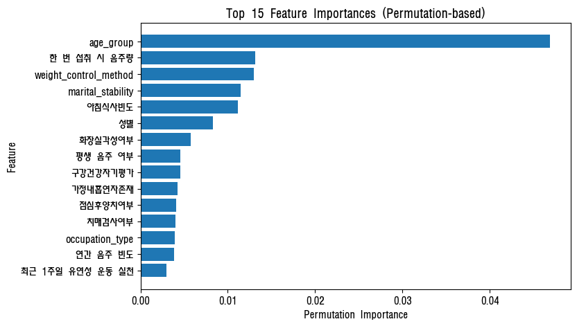 |

**주요 특성**: 궐련형전자담배, 연령, 혼인상태, 체중조절, 음주지표, 구강건강 등

</div>

### 5. 최종 모델 선정 사유 (CatBoost)

1. **범주형 처리 우수**: 원-핫 인코딩 없이 자동 처리, 정보 손실 최소화
2. **성능 우위**: ROC-AUC 0.7784, PR-AUC 0.7923으로 비교 모델 대비 최고
3. **해석성**: 내장 특성 중요도 및 Pool 기반 리포트 제공
4. **안정성**: 교차검증에서 일관된 성능 유지

---

## 산출물

### 문서 산출물

| 구분 | 파일명 | 설명 |
|---|---|---|
| **데이터 분석** | [데이터전처리결과서.md](docs/summary/eda/데이터전처리결과서.md) | EDA, 전처리, 가설 검증, 파생변수 |
| **모델 분석** | [인공지능학습결과서.md](docs/summary/model/인공지능학습결과서.md) | 모델 비교, 성능 평가, 선정 사유 |

### 시각화 산출물

- **EDA 시각화**: `docs/img/eda/` (컬럼별 분포, 상관관계, 가설 검증)
- **모델 시각화**: `docs/img/model/` (혼동행렬, ROC/PR Curve, 특성 중요도)

### 대시보드 (Streamlit)

<div align="center">

</div>

**주요 기능**:
1. **환자 정보 입력**: 개인 특성 데이터 수집
2. **금연 성공 확률 예측**: AI 모델 기반 실시간 예측
3. **상담자 전용 페이지**: PDF 리포트 생성
4. **맞춤 개입 제안**: 개인별 행동 개선 방향 제시

---

## 프로젝트 구조

<details>
<summary><b>전체 프로젝트 폴더 구조 보기</b></summary>

```bash
SKN19-2nd-2Team/
├── data/                        # 데이터 저장소
│   ├── raw_data.csv            # 원본 데이터
│   ├── analy_data_v2.csv       # 1차 전처리 (churn 추가)
│   └── prep_data_v2.csv        # 2차 전처리 (최종)
│
├── notebooks/                   # EDA & ML 실험 공간
│   ├── 김소희/                  # 가구/소득 분석
│   ├── 마한성/                  # 정신건강 분석
│   ├── 박도연/                  # 음주/신체활동 분석
│   ├── 오흥재/                  # 교육/경제활동 분석
│   ├── 임상민/                  # 식생활/비만 분석
│   └── team/                   # 팀 통합 작업
│       ├── 01_데이터정제.ipynb
│       ├── 02_ML학습준비.ipynb
│       ├── 05_ML모델비교.ipynb  # 최종 모델 비교
│       ├── preprocess.py       # 전처리 모듈
│       └── modules/            # 파생변수 생성 모듈
│           ├── features_ksh.py
│           ├── features_mhs.py
│           ├── features_ohj.py
│           ├── features_pdy.py
│           └── features_sangmin.py
│
├── smoke_churn_model/          # 모델 패키지 (운영 구상)
│   ├── component/
│   │   ├── train.py
│   │   ├── evaluate.py
│   │   └── predict.py
│   └── modules/
│       ├── config.py
│       └── preprocess.py
│
├── streamlit/                  # 대시보드 앱
│   ├── app.py                 # 메인 앱
│   ├── pages/
│   │   ├── 01_환자_정보_입력.py
│   │   ├── 02_상담자_전용.py
│   │   └── 90_설정_및_도움말.py
│   └── utils/                 # 유틸리티
│
├── docs/                      # 문서 저장소
│   ├── img/                   # 이미지
│   │   ├── eda/              # EDA 시각화
│   │   ├── model/            # 모델 시각화
│   │   └── readme/           # README 이미지
│   ├── summary/
│   │   ├── eda/              # 데이터전처리결과서
│   │   └── model/            # 인공지능학습결과서
│   └── master/
│       └── context.md        # 프로젝트 마스터 문서
│
└── README.md                  # 프로젝트 소개 (본 문서)
```

</details>

---

## 실행 방법

### 1. 환경 설정

```bash
# 저장소 클론
git clone https://github.com/your-repo/SKN19-2nd-2Team.git
cd SKN19-2nd-2Team

# Anaconda 가상환경 생성 및 활성화
conda create -n smoke_churn python=3.10
conda activate smoke_churn

# 필요한 패키지 설치
pip install -r requirements.txt
```

### 2. Streamlit 대시보드 실행

```bash
cd streamlit
streamlit run app.py
```

브라우저에서 `http://localhost:8501` 접속

### 3. 주요 노트북 실행

```bash
# Jupyter Notebook 실행
jupyter notebook

# 주요 노트북
# - notebooks/team/01_데이터정제.ipynb: 데이터 전처리
# - notebooks/team/02_ML학습준비.ipynb: 피처 생성
# - notebooks/team/05_ML모델비교.ipynb: 모델 학습 및 비교
```

---

## 프로젝트 관리

### WBS (Work Breakdown Structure)

<div align="center">
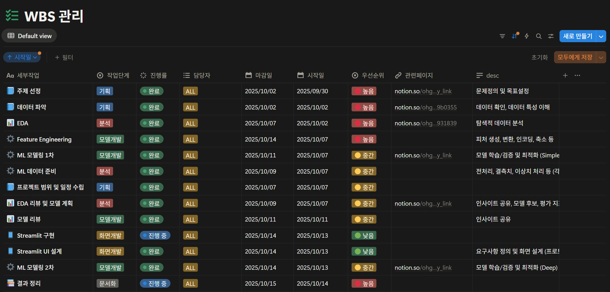
</div>

**주요 마일스톤**:
- Week 1: 데이터 이해 및 EDA
- Week 2: 전처리 및 파생변수 생성
- Week 3: 모델 학습 및 비교, 대시보드 개발 및 문서화

---

## 주요 인사이트

### 데이터 분석 관점
1. **고연령층**일수록 금연 성공률이 높음
2. **1인 가구**는 금연 성공률이 낮음 (사회적 지지 부족)
3. **폭음 빈도**가 높을수록 금연 실패 비율 증가
4. **금주 계획**이 있는 집단의 금연 성공률이 높음
5. **교육수준 × 경제활동** 상호작용 효과 발견

### 모델링 관점
1. **CatBoost**가 범주형 데이터 처리에 가장 우수
2. **파생변수 생성**으로 예측력 21.9%p 향상
3. **교육수준, 혼인상태, 직업** 등이 주요 예측 변수
4. **ROC-AUC 0.7784** 달성 (실용적 수준)

---

## 향후 계획

### 기술적 개선
- `smoke_churn_model/` 운영 패키징 고도화
- Streamlit 서비스 구체화 및 UI/UX 개선
- 모델 모니터링 지표 설정 및 재학습 자동화

### 기능 확장
- SHAP 값 기반 개인별 해석 리포트 추가
- 연도별 데이터 드리프트 모니터링 체계 구축
- 시계열 데이터 확보 시 longitudinal 모델 검토

---

## 한계 및 개선점

### 한계점
1. 설문 특수코드(7,8,9→NaN) 처리로 인한 정보 손실
2. 단면 조사 특성상 인과관계 추론 제한
3. 연도별 설문 설계 변화 시 모델 성능 저하 가능
4. 운영 패키징 미완 (시간 제약)

### 개선 방향
1. 앙상블 기법 추가 실험
2. 심층 특성 상호작용 분석
3. 모델 버전 관리 시스템 도입
4. 실시간 피드백 수집 시스템 구축

---

## 팀 회고

### 김소희
분석/모델 코드 통합과 트리 모델 분석을 담당하였다. 모델 비교 결과 계층형 트리는 여러 규칙을 쌓아 안정적으로 성능을 올렸고, 단일 결정트리는 특정 변수에 치우치면서 성능이 불안정함을 확인함으로써 모델의 특징(장점)을 이해할 수 있었다. 팀원마다 데이터 타입, 인코딩 규칙이 달라 동일한 조건에서 모델을 비교하는 과정에서 시행착오가 많았다. 모델 설계의 중요성을 깨달았고, 데이터 타입에 따른 인코딩 규칙 등을 사전에 통일해 그 기반으로 빠르게 모델을 비교하면서 분석에 더 집중할 수 있는 시간이 확보하는게 중요함을 느끼는 시간이었다.

### 마한성
설문 데이터 EDA 과정에서 복잡한 데이터 구조를 파악하는 데 시간이 걸렸고, 명확한 타겟 변수가 없어 여러 피처를 조합해 라벨을 직접 생성했다. 타겟과 높은 상관관계를 보이는 특성들을 발견했는데, 전부 제거하면 정확도가 크게 떨어지고 모두 포함하면 과적합이 발생해, 해당 피처들을 변형하고 선택적으로 조합하는 데 많은 시간을 투자했다. 실무 데이터의 불완전성과 피처 간 복잡한 관계를 다루는 경험을 쌓았으며, 다음에는 초반 데이터 구조 분석과 타겟 정의에 더 많은 시간을 할애하고, 개별 작업보다 팀원들과 함께 데이터를 검토하며 방향을 논의하는 시간을 늘려야겠다.

### 박도연
데이터를 분배해서 각자 파악 및 분석을 진행했더니 충분히 인사이트 공유를 했다고 생각했음에도 나중에 데이터 통합에 어려움을 겪었다. 각자 맡은 모델에 맞게 특성 공학을 진행했다보니 데이터셋을 통합시킨 후 재학습 시켰을 때 성능이 떨어지는 문제를 보였다. 무엇보다 특성 공학을 다양하게 진행해도 성능이 눈에 띄게 오르지 않음을 확인함으로써 질 좋은 데이터를 확보하는 게 중요하단 걸 깨달았다.

### 오흥재
공공데이터의 복잡성을 이해하고 정제 과정의 중요성 인식, Git·LFS 협업 경험 및 MCP 환경에서의 데이터 관리 능력 향상, 금연 예측이라는 사회적 주제에 데이터 사이언스 접근 적용 경험을 쌓았다. 깃을 제대로 활용해본 기분이어서 이 점은 좋았고 다른분의 코드를 보면서 배우는 시간이었다.

### 임상민
EDA는 '빨리 예측 잘하는 모델'을 찾는 과정이 아니다. 문제를 명확히 정의하고, 데이터에 언어를 부여하는 과정이다. 이번 프로젝트에서 느꼈던 복잡함은 결국 기준을 세우고 기록하는 습관을 만들게 했고, 그 습관이 다음 프로젝트의 속도와 품질을 결정할 것임을 배웠다.

---

## 참고 자료

### 주요 문서
- [데이터전처리결과서](docs/summary/eda/데이터전처리결과서.md)
- [인공지능학습결과서](docs/summary/model/인공지능학습결과서.md)

### 데이터 출처
- [지역사회건강조사 공식 웹사이트](https://chs.kdca.go.kr/)
- [질병관리청 2024년 원시자료 이용지침서](docs/Community_Health_Survey_2024_Raw_Data_Use_Guidelines.pdf)

### 기술 스택 참고
- [CatBoost Documentation](https://catboost.ai/docs/)
- [Streamlit Documentation](https://docs.streamlit.io/)
- [scikit-learn Documentation](https://scikit-learn.org/)

---

<div align="center">

**Built with ❤️ by 이조는 차분하조**

© 2024 SKN19-2nd-2Team. All rights reserved.

</div>
