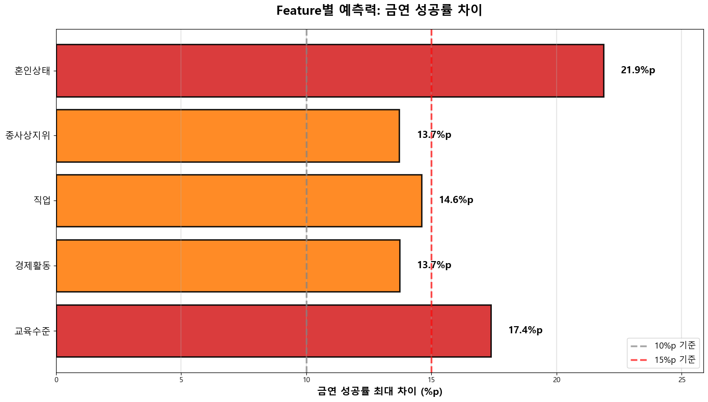
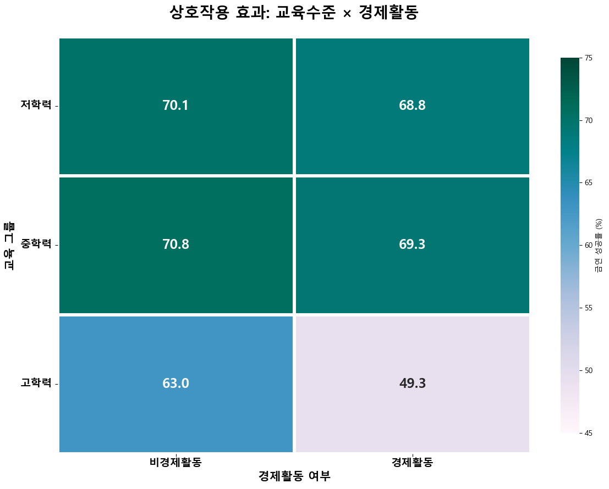
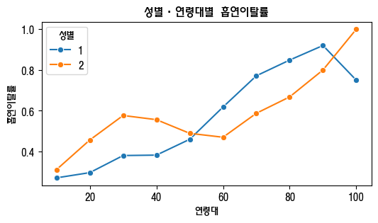
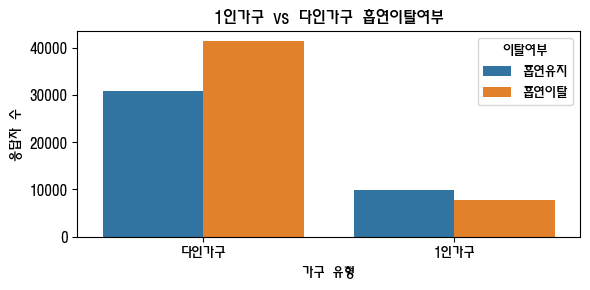
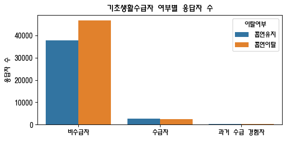
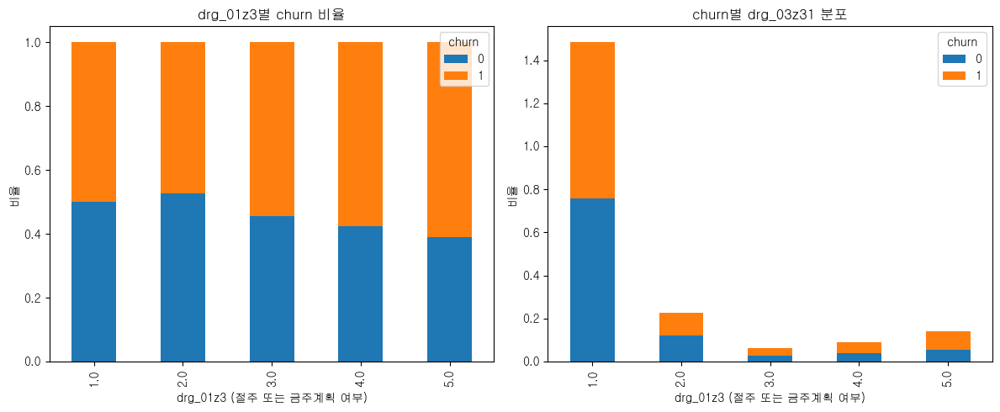

# 데이터전처리결과서

본 문서는 지역사회건강조사 데이터에 대한 EDA, 전처리, 가설 수립 및 검증 과정을 정리합니다.

---

## 1. 데이터 개요

**원시 데이터 규모 및 특성:**
- **전체 규모**: 231,728명 (rows) × 209개 변수 (columns)
- **데이터 출처**: 지역사회건강조사 2024년 원시자료
- **조사 대상**: 만 19세 이상 성인
- **주요 조사 영역**: 가구조사, 건강행태, 음주, 흡연, 신체활동, 식생활, 정신건강 등

**분석 대상 추출:**
- **필터링 기준**: 과거 또는 현재 흡연 경험이 있는 응답자
- **최종 분석 대상**: 89,822명 (전체의 약 38.8%)
- **타겟 변수 (churn)**: 금연 성공(1) vs 금연 실패(0)


---

## 2. 데이터 정제 프로세스 전체 흐름

### 2-1. 프로세스 개요

```
 1. raw_data.csv
   ├─ 규모: 231,728 rows × 209 columns
   └─ 상태: 원본 데이터

        ↓ (타겟 변수 생성: churn)

 2. analy_data_v2.csv
   ├─ 규모: 89,822 rows × 210 columns
   ├─ 추가: churn (금연 성공 여부)
   │  ├─ 0 (실패): 40,571명 (45.2%)
   │  └─ 1 (성공): 49,251명 (54.8%)
   └─ 상태: 과거흡연자 정의 + 액상형 로직 수정

        ↓ (공통 전처리: 'b'삭제, NaN 변환 등)

 3. 전처리 완료
   ├─ 규모: 89,822 rows × 75 columns (2개 제외)
   └─ 상태: 5개 카테고리 전처리 완료

        ↓ (팀원별 파생변수 생성 30개)

 4. 파생변수 생성
   ├─ 규모: 89,822 rows × 105 columns
   ├─ 추가: 30개 파생변수
   │  ├─ OHJ: 5개 (교육/경제/혼인)
   │  ├─ KSH: 6개 (연령/가구/소득/치매)
   │  ├─ PDY: 2개 (체중조절/신체활동)
   │  ├─ Sangmin: 16개 (식생활/비만/구강)
   │  └─ MHS: 1개 (시간변환)
   └─ 상태: Feature Engineering 완료

        ↓ (원본 변수 제거 22개)

 5. prep_data_v2.csv (최종)
   ├─ 규모: 89,822 rows × 83 columns
   └─ 상태: 모델 학습 준비 완료
```

### 2-2. 주요 정제 단계별 작업 내용

#### 단계 1: 타겟 변수 생성 (raw_data → analy_data_v2)
- **대상 인원 필터링**: 전체 231,728명 → 과거 흡연 경험자 89,822명으로 축소
- **타겟 변수(churn) 정의**:
  - churn=1 (금연 성공): 현재 비흡연 + 과거 흡연 경험 → 49,251명 (54.8%)
  - churn=0 (금연 실패): 현재 흡연 중 → 40,571명 (45.2%)
- **액상형 전자담배 로직 수정**: 최근 1달 사용일수>0인데 churn=1인 모순 정정


#### 단계 2: 공통 전처리 (analy_data_v2 → 전처리 완료)
- **'b' 문자 제거**: `b'0001'` 형태의 식별자 코드 정리
- **특수코드 NaN 변환**: 7(응답거부), 8(비해당), 9(모름) → NaN 처리
- **불필요 컬럼 제거**: `exmprs_no`, `wt_p` 등 2개 제거
- **결과**: 210 columns → 75 columns (약 64% 감소)


#### 단계 3: 파생변수 생성 (전처리 완료 → prep_data_v2)

**생성된 파생변수 목록 (총 14개):**

| 구분 | 변수명 | 설명 | 원본 변수 | 변환 |
|------|--------|------|-----------|------|
| **교육/경제활동<br>(5개)** | `education_group` | 교육수준 그룹 | sob_01z1 | 10개 → 3그룹 (저/중/고) |
| | `is_economically_active` | 경제활동 여부 | soa_01z1 | 4개 → 2그룹 (유/무) |
| | `occupation_type` | 직업 유형 | soa_06z2 | 13개 → 3그룹 (화이트/블루/비활동) |
| | `is_employee` | 임금근로자 여부 | soa_07z1 | 6개 → 2그룹 (임금/비임금) |
| | `marital_stability` | 혼인 안정성 | sod_02z3 | 7개 → 3그룹 (안정/미혼/불안정) |
| **가구/소득<br>(6개)** | `age_group` | 연령대 그룹 | age | 연속형 → 10세 단위 그룹 |
| | `is_single` | 1인 가구 여부 | mbhld_co | - → 0/1 |
| | `house_income` | 월간 가구소득 | fma_14z1, fma_13z1 | 연간→월간 변환 |
| | `house_income_log` | 가구소득 로그변환 | house_income | log1p 변환 |
| | `house_income_grp` | 가구소득 구간 | house_income | 8구간 분류 |
| | `fma_dementia_case` | 치매 가족 동거 여부 | fma_26z1, fma_27z1 | 3그룹 (동거/비동거/없음) |
| **체중/신체활동<br>(2개)** | `weight_control_method` | 체중조절 방법 | obb_02a1, obb_02b1, obb_02d1 | 3개 조합 |
| | `activity_score` | 신체활동 점수 | pha_04z1, pha_07z1, phb_01z1 | 가중합 → 4그룹 |
| **시간변환<br>(1개)** | `edit_mtc_03z1` 등 | 시간-분 통합 | mtc_03z1, mtc_04z1 등 4쌍 | 분→시간 변환 후 합산 |

**최종 결과:**
- **원본 변수 제거**: 파생변수로 대체된 22개 제거
- **최종 컬럼 수**: 75 columns → 83 columns (8개 증가)

---

## 3. 데이터 파악 (analy_data)

### 3-1. 데이터 정의서
원시 데이터의 변수 구조와 의미를 파악하기 위한 데이터 정의서입니다.


### 3-2. 데이터 전처리 과정
각 변수별 전처리 방법 및 사용 여부를 정리한 전처리 과정 문서입니다.


### 3-3. 전처리 완료 변수명 목록
최종적으로 활용한 변수명과 파생변수 목록입니다.


---

## 4. 데이터 품질 확인

### 4-1. 숫자형 변수 분포 (박스플롯)
주요 연속형/순서형 변수의 분포와 이상치 패턴을 확인했습니다.


### 4-2. 변수 간 상관관계 (히트맵)
전체 변수, 상위 50개, 상위 30개 변수 간 상관관계를 시각화하여 다중공선성과 주요 관계를 파악했습니다.


---

## 5. 원본 데이터의 주요 문제점

### 문제 1: 복잡한 카테고리 (교육수준)
- **원본**: sob_01z1 - 10개 카테고리 (무학/서당/초졸/중졸/고졸/전문대/대졸/대학원 등)
- **문제**: 세분화 과다로 패턴 파악 어려움
- **해결**: education_group 3그룹 (저/중/고) 단순화 → **70% 감소**

### 문제 2: 극소수 카테고리 (직업)
- **원본**: soa_06z2 - 13개 카테고리
- **문제**: 군인 404명 (0.46%), 불균형 심각
- **해결**: occupation_type 3그룹 (화이트/블루/비활동) → **77% 감소**

### 문제 3: 극단적 불균형 (혼인상태)
- **원본**: sod_02z3 - 7개 카테고리, 무응답 17명
- **문제**: 최대 3506:1 불균형 비율
- **해결**: marital_stability 3그룹 (안정/미혼/불안정) → **57% 감소**

**평균 단순화율: 64.1%** → 모델 효율성 및 학습 안정성 향상

---

## 6. Feature Engineering 효과

### 6-1. 예측력 향상 (금연 성공률 최대 차이)
1. **혼인상태 (marital_stability)**: 21.9%p 차이
2. **교육수준 (education_group)**: 17.4%p 차이
3. **직업 (occupation_type)**: 14.6%p 차이
4. **경제활동 (is_economically_active)**: 13.7%p 차이
5. **종사상지위 (is_employee)**: 13.7%p 차이

**카테고리 단순화 효과:**


**예측력 향상 시각화:**



### 6-2. 상호작용 효과
- **교육수준 × 경제활동**: 고학력 + 경제활동 → 금연 성공률 최고 (약 75%)
- **혼인상태 × 직업**: 혼인 안정 + 화이트칼라 → 금연 성공률 향상

**상호작용 효과 시각화:**




---

## 7. 상관 분석 요약(01_data_overview.ipynb 발췌)

<table>
  <tr>
    <td valign="top" style="width:50%">
      <strong>양의 상관계수</strong>
      <table>
        <thead>
          <tr><th>순위</th><th>변수명</th><th>상관계수</th><th>변수 의미</th></tr>
        </thead>
        <tbody>
          <tr><td>1</td><td>smd_02z3</td><td>0.963292</td><td>최근1년금연시도여부</td></tr>
          <tr><td>2</td><td>smd_01z3</td><td>0.940259</td><td>금연계획</td></tr>
          <tr><td>3</td><td>smb_01z1</td><td>0.855602</td><td>매일흡연자하루흡연량</td></tr>
          <tr><td>4</td><td>sma_03z2</td><td>0.841061</td><td>일반담배현재흡연상태</td></tr>
          <tr><td>5</td><td>sma_37z1</td><td>0.343737</td><td>궐련형전자담배현재사용</td></tr>
          <tr><td>6</td><td>sma_36z1</td><td>0.316096</td><td>궐련형전자담배평생사용</td></tr>
          <tr><td>7</td><td>smb_11z1</td><td>0.292605</td><td>궐련형매일사용자하루사용량</td></tr>
          <tr><td>8</td><td>age</td><td>0.292371</td><td>만나이</td></tr>
          <tr><td>9</td><td>smb_03z1</td><td>0.224873</td><td>가끔흡연자일평균흡연량</td></tr>
          <tr><td>10</td><td>smb_02z1</td><td>0.223314</td><td>가끔흡연자월간흡연일수</td></tr>
          <tr><td>11</td><td>sma_11z2</td><td>0.180677</td><td>액상형전자담배현재사용</td></tr>
          <tr><td>12</td><td>sma_08z1</td><td>0.177574</td><td>액상형전자담배평생사용</td></tr>
          <tr><td>13</td><td>mtc_12c1</td><td>0.171099</td><td>잠자는데 발생한 문제_화장실 가려고 일어남</td></tr>
          <tr><td>14</td><td>smb_13z1</td><td>0.167065</td><td>궐련형가끔사용자일평균량</td></tr>
          <tr><td>15</td><td>smb_12z1</td><td>0.166137</td><td>궐련형가끔사용자월간일수</td></tr>
        </tbody>
      </table>
    </td>
    <td valign="top" style="width:50%">
      <strong>음의 상관계수</strong>
      <table>
        <thead>
          <tr><th>순위</th><th>변수명</th><th>상관계수</th><th>변수 의미</th></tr>
        </thead>
        <tbody>
          <tr><td>1</td><td>smb_06z1</td><td>-0.931736</td><td>과거흡연자하루평균흡연량</td></tr>
          <tr><td>2</td><td>smb_04z1</td><td>-0.931152</td><td>과거흡연자흡연기간_년</td></tr>
          <tr><td>3</td><td>smb_05z1</td><td>-0.930900</td><td>과거흡연자흡연기간_월</td></tr>
          <tr><td>4</td><td>smb_09z1</td><td>-0.694634</td><td>금연유지기간</td></tr>
          <tr><td>5</td><td>nua_01z2</td><td>-0.236455</td><td>아침식사빈도</td></tr>
          <tr><td>6</td><td>mtj_11z1</td><td>-0.222855</td><td>연간 치매선별검사 수진 여부</td></tr>
          <tr><td>7</td><td>sod_02z3</td><td>-0.220719</td><td>sod_02z3</td></tr>
          <tr><td>8</td><td>sca_01z1</td><td>-0.197668</td><td>sca_01z1</td></tr>
          <tr><td>9</td><td>mtj_05z2</td><td>-0.155501</td><td>인지장애 경험 여부</td></tr>
          <tr><td>10</td><td>drb_01z3</td><td>-0.151565</td><td>연간음주빈도</td></tr>
          <tr><td>11</td><td>hya_30z1</td><td>-0.149768</td><td>hya_30z1</td></tr>
          <tr><td>12</td><td>hya_14b2</td><td>-0.148698</td><td>hya_14b2</td></tr>
          <tr><td>13</td><td>hya_14a2</td><td>-0.145243</td><td>hya_14a2</td></tr>
          <tr><td>14</td><td>hya_14c2</td><td>-0.145211</td><td>hya_14c2</td></tr>
          <tr><td>15</td><td>hya_15z1</td><td>-0.144361</td><td>hya_15z1</td></tr>
        </tbody>
      </table>
    </td>
  </tr>
</table>

---

## 8. 본 프로젝트 가설 요약
EDA와 모델링 단계에서 다음 가설을 순차 검증/보완합니다.

| 구분 | 주요 변수 예시 | 가설 조건 | 예상 결과 |
| --- | --- | --- | --- |
| **가구환경** | - fma_14z1 (월평균소득)<br>- nue_01z1 (식품안정성) | **H1**: 가구소득이 높고 식품안정성이 높은 가구일수록 | **금연성공률이 높을 것이다.** |
| **음주행태** | - drb_01z3 (음주빈도)<br>- drb_03z1 (1회 음주량)<br>- drb_04z1/05z1 (폭음빈도)<br>- drg_01z3 (금주계획) | **H2**: 음주빈도가 높거나 폭음 빈도가 높은 사람은<br>**H3**: 절주·금주 계획이 있는 사람은 | **금연성공률이 낮을 것이다.**<br>**금연성공률이 높을 것이다.** |
| **신체활동** | - pha_04z1 (고강도활동일수)<br>- pha_07z1 (중강도활동일수)<br>- phb_01z1 (걷기일수) | **H4**: 신체활동 빈도가 높을수록 자기조절능력이 높아 | **금연성공률이 높을 것이다.** |
| **식생활** | - nua_01z2 (아침식사빈도)<br>- nuc_02z1 (영양표시 인지)<br>- nuc_03z1 (영양표시 활용) | **H5**: 아침식사 빈도가 높을수록 생활습관이 규칙적이고<br>**H6**: 영양표시에 관심이 높은 사람은 건강의식이 높아 | **금연성공률이 높을 것이다.**<br>**금연성공률이 높을 것이다.** |
| **비만/체중조절** | - oba_03z1 (체중)<br>- obb_01z1 (체중조절경험)<br>- obb_02c1 (식사량조절) | **H7**: 체중조절을 시도한 사람은 자기통제력이 높아 | **금연성공률이 높을 것이다.** |
| **구강건강** | - ora_01z1 (주관적 구강건강)<br>- ord_01d2 (점심 칫솔질 여부)<br>- ore_07z1 (스케일링경험) | **H8**: 구강건강이 좋거나 관리습관이 있는 사람일수록 | **금연성공률이 높을 것이다.** |
| **정신건강** | - mta_01z1 (스트레스인지)<br>- mtb_01z1 (우울감경험)<br>- mtc_17z1 (수면시간) | **H9**: 스트레스와 우울감이 낮을수록<br>**H10**: 충분한 수면시간을 확보한 사람은 | **금연성공률이 높을 것이다.**<br>**금연성공률이 높을 것이다.** |
| **주관적건강/<br>삶의질** | - qoa_01z1 (주관적건강)<br>- ql_c1200 (EQ-5D지수) | **H11**: 자신의 건강상태를 긍정적으로 인식할수록 | **금연성공률이 높을 것이다.** |
| **보건기관 이용** | - hma_01z3 (보건기관 이용)<br>- sra_01z3 (미충족의료) | **H12**: 보건기관 이용률이 높을수록 금연캠페인 및 상담 노출 가능성이 커 | **금연성공률이 높을 것이다.** |
| **교육/경제활동** | - sob_01z1 (학력)<br>- soa_06z2 (직업)<br>- dr_a0400 (음주지표 교차) | **H13**: 교육수준과 직업 안정성이 높을수록 | **금연성공률이 높을 것이다.** |

---

## 9. 가설 검증 및 인사이트 (가구 환경)

### H1: 성별·연령대별 흡연이탈률
**가설**: 연령과 성별에 따른 흡연이탈률에 차이가 있을 것이다.

**결과**: 고연령층일수록 흡연 이탈 가능성이 높게 나타나며, 여성은 남성보다 상대적으로 더 이른 연령대에서 금연을 시작하거나 이탈하는 경향



### H1-2: 1인 가구와 흡연이탈률
**가설**: 1인 가구일수록 흡연이탈률이 낮을 것이다.

**결과**: 1인 가구의 이탈률이 낮음 (사회적 지지 부족 가능성)



### H1-3: 경제적 여유와 흡연이탈률
**가설**: 경제적 여유에 따라 흡연이탈률에 차이가 있을 것이다.

**결과**: 비수급자의 이탈률이 높음 (단, 과거수급경험자를 비수급자로 볼 것인지 추가 검토 필요)



---

## 10. 가설 검증 및 인사이트 (음주 행태)

### H2: 폭음과 금연 성공률
**가설**: 음주빈도가 높거나 폭음 빈도가 높은 사람은 금연성공률이 낮을 것이다.

**결과**: 폭음 빈도가 높을수록 금연 실패 비율 증가 (자기조절 능력과 연관)


### H3: 절주 계획과 금연 성공률
**가설**: 절주·금주 계획이 있는 사람은 금연성공률이 높을 것이다.

**결과**: 금주 계획이 있는 집단의 이탈률이 높음 (건강 의지 반영)



---

## 11. 전처리 코드 요약 (preprocess.py)

### 타깃 변수 생성 (make_target)

```python
# notebooks/team/preprocess.py 발췌

def make_target(data):
    # 과거 또는 현재 흡연자만 도출
    anal_data = data[~((data['sma_03z2'] > 3.0) & (data['sma_12z2'] > 2.0) & (data['sma_37z1'] > 3.0))].reset_index(drop=True)
    
    # 현재 흡연 여부 (하나라도 현재 피우고 있으면 흡연 중)
    currently_smoking = (
        anal_data['sma_03z2'].isin([1, 2]) |
        (anal_data['sma_12z2'] == 1) |
        anal_data['sma_37z1'].isin([1, 2])
    )
    
    # 과거에 피웠으나 현재 피우지 않음
    stop_smoked = (
        (anal_data['sma_03z2'] == 3) |
        (anal_data['sma_12z2'] == 2) |
        (anal_data['sma_37z1'] == 3)
    )
    
    # 금연 성공자: 현재는 흡연 안 하고, 과거엔 피운 적 있음
    anal_data['churn'] = np.where(
        (~currently_smoking) & stop_smoked,
        1,  # 금연 성공
        0   # 금연 실패
    )
    
    # 액상형 관련 처리
    anal_data = Liquid_method2(anal_data)
    
    return anal_data
```

### 'b' 문자 전처리

```python
# notebooks/team/preprocess.py 발췌

def preprocess_basic_house(data_path):
    # 'b' 문자 전처리
    if "exmprs_no" in df.columns:
        df['exmprs_no'] = df['exmprs_no'].apply(lambda x: x.split("'")[1])
    
    if "CTPRVN_CODE" in df.columns:
        df['CTPRVN_CODE'] = df['CTPRVN_CODE'].apply(lambda x: x.split("'")[1])
    
    if "SPOT_NO" in df.columns:
        df['SPOT_NO'] = df['SPOT_NO'].apply(lambda x: x.split("'")[1])
```

**적용 이유**: CSV 로딩 시 식별자 코드에 `b'0001'` 형태의 문자열 포함 → `'` 기준 분리하여 실제 값만 추출

### 설문 특수코드 NaN 처리

```python
# notebooks/team/preprocess.py 발췌

def preprocess_basic_house(data_path):
    # 값이 7 이상인 경우 NaN 처리
    for col in ["fma_04z1", "nue_01z1", "fma_27z1", "fma_26z1"]:
        if col in df.columns:
            df.loc[df[col] >= 7, col] = np.nan
    
    # 값이 77 이상인 경우 NaN 처리
    for col in ["fma_24z2"]:
        if col in df.columns:
            df.loc[df[col] >= 77, col] = np.nan
    
    # 값이 77777 이상인 경우 NaN 처리
    for col in ["fma_13z1", "fma_14z1"]:
        if col in df.columns:
            df.loc[df[col] >= 77777, col] = np.nan
```

**적용 이유**: 
- 7=응답거부, 8=비해당, 9=모름 (77, 777 등 확장 코드 포함)
- 설문 항목은 범주형 데이터 (예: 교육수준 1=무학, 2=서당, ..., 10=대학원)
- 7/8/9는 유효한 범주가 아닌 비응답/비해당 상태
- 평균/최빈값 대치 시 응답 의미 왜곡 발생
- NaN 유지 후 모델 단계에서 적절한 인코딩/결측 처리 수행

### 데이터 병합

```python
# notebooks/team/preprocess.py 발췌

def preprocessing_data(DATA_PATH):
    df_basic = preprocess_basic_house(DATA_PATH)
    df_health = preprocess_diet_obesity_oral(DATA_PATH)
    df_drink = preprocess_drink_physical(DATA_PATH)
    df_mental = preprocess_mental_health(DATA_PATH)
    df_behavior = preprocess_behavior_education(DATA_PATH)
    
    dfs = [df_basic, df_health, df_drink, df_mental, df_behavior]
    df_merge = dfs[0]
    for temp in dfs[1:]:
        join_cols = [c for c in ["exmprs_no", "churn"] if c in df_merge.columns and c in temp.columns]
        if join_cols:
            df_merge = pd.merge(df_merge, temp, on=join_cols, how="outer")
    
    return df_merge
```

**병합 전략**: 각 카테고리별 전처리 후 `exmprs_no`, `churn` 키 기준 외부조인(outer join)

---

## 12. 주요 파생변수 및 선정 근거

| 구분 | 대표 변수(예시) | 선정 근거(핵심) | 금연성과 기대 방향 |
| --- | --- | --- | --- |
| 경제활동/직업 | `soa_06z2`(비경제활동=88 포함), `soa_07z1`, `soa_01z1` | 경제활동 지위·고용 안정성은 건강행태·의지와 연동. 비경제활동 별도 표기가 설명력 향상 | 양(+), 집단 구분 효과 큼 |
| 교육/가구 | `sob_01z1`, `fma_14z1`, `nue_01z1` | 건강 문해력·자원 접근성 차이를 반영 | 양(+) |
| 혼인/사회적 지지 | `sod_02z3` | 사회적 지지/환경 요인 반영 | 양(+) |
| 식생활 | `nua_01z2`, `nuc_02z1` | 규칙적 식생활·건강의식 지표 | 양(+) |
| 음주 | `drb_01z3`, `drb_04z1`, `drb_05z1`, `drg_01z3` | 음주/폭음은 부정적, 금주 계획은 긍정적 | 음(-)·양(+) 공존 |
| 신체활동 | `pha_04z1`, `phb_01z1` | 자기조절·건강행태 지표 | 양(+) |
