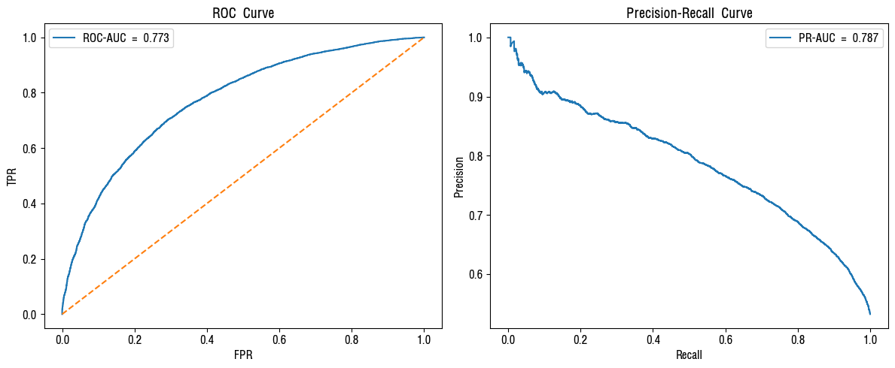
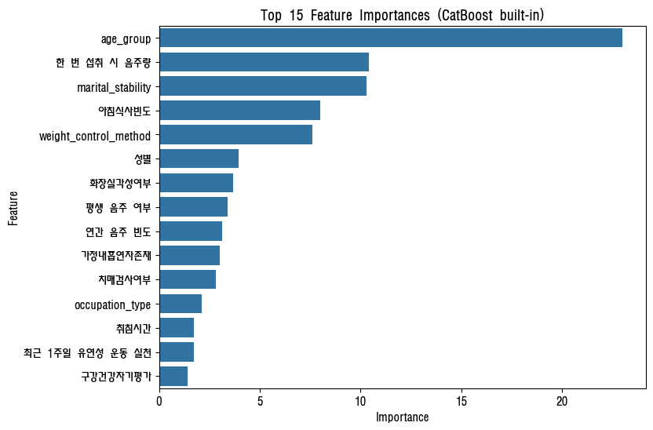

# 인공지능학습결과서

## 1. 모델링 전략 및 목표
### 전략
- **데이터 분할**: Stratified 기반 학습/검증/테스트 분리, 클래스 비율 유지
- **검증 방법**: Stratified K-Fold(K=5) 교차검증으로 성능 안정성 확인
- **평가지표**: ROC-AUC(주지표), Accuracy, PR-AUC(불균형 보정)
- **모델 후보**: CatBoost, XGBoost, LightGBM, HistGradientBoosting
- **최종 선택**: 하이퍼파라미터 그리드탐색 후 AUC 기준 최고 성능 모델 선정

### AUC를 주평가지표로 선택한 이유
1. 분류 임계값에 덜 민감하여 전체 구간 성능을 평가
2. 클래스 불균형 상황에서도 강건
3. 운영 단계에서 임계값 조정 시에도 모델 간 우열 비교 가능

---

## 2. 데이터 분할 및 전처리
```python
# notebooks/team/05_ML모델비교.ipynb 발췌

from sklearn.model_selection import train_test_split

# 데이터 분리
X = df_test.drop(TARGET_NM, axis=1)
y = df_test[TARGET_NM]

# 학습/테스트 (8:2)
X_train, X_test, y_train, y_test = train_test_split(
    X, y, test_size=0.2, stratify=y, random_state=2
)
# (71857, 41) (71857,) (17965, 41) (17965,)
```

### 범주형 변수 처리
- **CatBoost**: 내장 `cat_features` 지정, 자동 인코딩
- **XGBoost/LightGBM**: `astype('category')` 변환 후 `enable_categorical=True`
- **HistGradientBoosting**: sklearn 1.2+ 범주형 지원

```python
def encoding_catboost(X_df):
    cat_features = [i for i, dtype in enumerate(X_df.dtypes) if dtype == 'object']
    cat_feature_names = [X_df.columns[i] for i in cat_features]
    for col in cat_feature_names:
        X_df[col] = X_df[col].replace([np.nan, np.inf, -np.inf], 'missing').astype(str)
    return X_df, cat_features
```

---

## 3. 모델 학습 및 성능 비교
```python
# 초기 하이퍼파라미터 (각 팀원 실험 결과 종합)
catb_params = {
    'iterations': 500,
    'learning_rate': 0.05,
    'depth': 6,
    'eval_metric': 'Accuracy',
    'verbose': 100
}
xgb_params = {
    'n_estimators': 300,
    'max_depth': 6,
    'learning_rate': 0.07,
    'subsample': 0.9,
    'colsample_bytree': 0.9,
    'tree_method': "hist",
    'eval_metric': "aucpr"
}
lgb_params = {
    'objective': 'binary',
    'boosting_type': 'gbdt',
    'learning_rate': 0.05,
    'num_leaves': 31,
    'class_weight': 'balanced'
}
hgb_params = {
    'learning_rate': 0.01,
    'max_depth': 5,
    'max_iter': 300
}
```

### 학습 결과
| 모델 | Accuracy | ROC_AUC | PR_AUC | 학습시간(초) |
| :--- | ---:| ---:| ---:| ---:|
| **CatBoost** | **0.707041** | **0.778440** | **0.792318** | 100.078 |
| LightGBM | 0.706151 | 0.776717 | 0.791158 | 0.531 |
| HistGradientBoosting | 0.697356 | 0.769087 | 0.782641 | 3.458 |
| XGBoost | 0.692124 | 0.761414 | 0.778780 | 2.301 |

> CatBoost가 ROC-AUC, PR-AUC 모두 최고 성능

---

## 4. 하이퍼파라미터 최적화 (GridSearch)
```python
from sklearn.model_selection import ParameterGrid, StratifiedKFold

# 베스트 모델 자동 선택
best_model = df_results[df_results['ROC_AUC']==df_results['ROC_AUC'].max()]['Model'].item()
# 베스트 모델: CatBoost

# 5-Fold 교차검증 수행
cv = StratifiedKFold(n_splits=5, shuffle=True, random_state=2)
for fold, (train_idx, val_idx) in enumerate(cv.split(X_train, y_train), 1):
    # ... 모델 학습 및 평가
    print(f"Fold {fold}: acc={acc:.4f}, auc={auc:.4f}, pr_auc={pr_auc:.4f}")
```

---

## 5. 최종 모델 성능 및 시각화
### 최종 성능 (CatBoost, test set)
- **Accuracy**: 0.7067
- **ROC-AUC**: 0.7784
- **PR-AUC**: 0.7923

### 혼동행렬


### ROC Curve & Precision-Recall Curve


### 특성 중요도 (CatBoost 내장)


### 특성 중요도 (Permutation 기반)


---

## 6. 최종 모델 선정 사유
### CatBoost 선택 이유
1. **범주형 처리 우수**: 원-핫 인코딩 없이 자동 처리, 정보 손실 최소화
2. **성능 우위**: ROC-AUC 0.7784, PR-AUC 0.7923으로 비교 모델 대비 최고
3. **해석성**: 내장 특성 중요도 및 Pool 기반 리포트 제공
4. **안정성**: 교차검증에서 일관된 성능 유지

### 주요 관찰 사항
- **평생 음주 여부(`dra_01z1`) 제외 시 성능 하락**: 연간 음주 빈도와 유사해 보이지만, 제거 시 정보 손실 → 조합 정보가 금연 구분에 기여
- **반복 상위 변수**: 궐련형전자담배, 연령, 혼인상태, 체중조절, 음주, 구강건강 등 생활지표
- **주의**: 특성 중요도는 인과관계가 아닌 관련성 신호

---

## 7. 실험 노트 (특성 중요도 관찰)
### Decision Tree vs HGB 비교 (피처 58 vs 42개)
- 피처 축소(58→42) 후 `age_group` 단일 변수 의존 증가 → 일반화 성능 하락 가능성
- 같은 42개 피처에서 DT 대비 HGB가 성능·안정성 우위
- 전자담배, 만나이, 혼인상태, 음주량 등이 정보 다양성 확보에 기여


---

## 8. 한계 및 개선 계획
### 한계
- 설문 특수코드(7,8,9→NaN) 처리로 인한 정보 손실
- 교차연결 변수의 잠재적 교란 가능성
- 연도별 설문 설계 변화 시 모델 성능 저하 리스크

### 개선 계획
- 연도별 데이터 드리프트 모니터링 체계 구축
- 주기적 재학습 자동화 파이프라인 구현
- `smoke_churn_model/` 운영 패키징 고도화 (현재 시간 제약으로 미완)
- SHAP 값 기반 개인별 해석 리포트 추가

